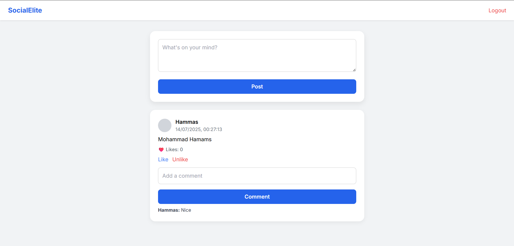
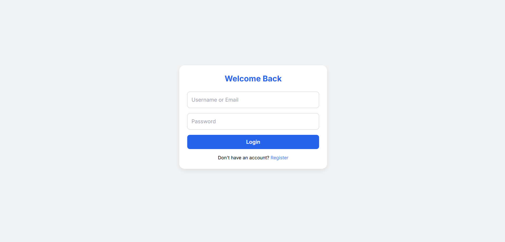
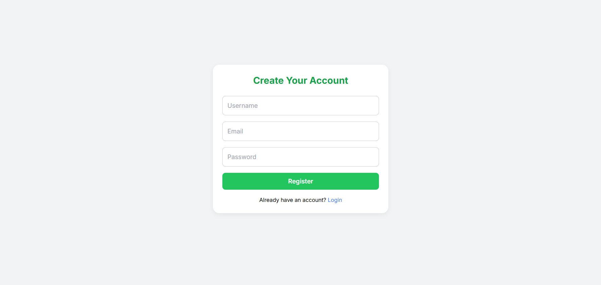

# Social Media App (CodeAlpha Task)

A full-stack **social media platform** built as part of the CodeAlpha internship — complete with authentication, post sharing, likes, comments, user profiles, and follow system.

This project mimics the core functionality of platforms like Instagram and Facebook, designed with a clean frontend and scalable backend architecture.

---

## 🚀 Features

- 🔐 **Authentication** (JWT-based login/register)
- 📝 **Post Creation** – Users can share text-based posts
- ❤️ **Like/Unlike Posts**
- 💬 **Commenting** on posts
- 🧑‍🤝‍🧑 **Follow/Unfollow Users**
- 👤 **User Profiles** – View your own posts and details
- 🌐 **Frontend UI** built with HTML, CSS, JS + Tailwind (styled like a real product)
- ⚙️ **Express.js Backend API**
- 💾 **MongoDB Database Integration**

---

## 🧱 Tech Stack

| Layer        | Tech Used                      |
|-------------|---------------------------------|
| Frontend     | HTML, CSS, JavaScript, Tailwind |
| Backend      | Node.js, Express.js             |
| Database     | MongoDB (via Mongoose)          |
| Auth         | JWT (JSON Web Token)            |
| Styling      | Tailwind CSS + custom design    |
| Dev Tools    | Nodemon, Postman (for testing)  |

---

## 📁 Folder Structure

```
Social app/
├── frontend/
│   ├── feed.html
│   ├── login.html
│   ├── register.html
│   ├── myprofile.html
│   └── styles/
│       └── layout.css
│   └── scripts/
│       ├── main.js
│       └── auth.js
├── backend/
│   ├── server.js
│   ├── models/
│   ├── routes/
│   ├── controllers/ (if separated)
│   └── .env
```

---

## 📷 UI Screenshots

### 📰 Feed Page


### 🔐 Login Page


### 👤 My Profile Page


---

## ⚙️ How to Run Locally

### 1. Clone the repo

```bash
git clone https://github.com/HammasCodes/CodeAlpha_tasks.git
cd CodeAlpha_tasks
```

### 2. Install dependencies

```bash
cd backend
npm install
```

### 3. Setup `.env`

Create a `.env` file in `/backend` and add:

```
MONGO_URI=your_mongodb_uri
JWT_SECRET=your_secret
PORT=5000
```

### 4. Start the server

```bash
npx nodemon server.js
```

### 5. Open frontend

Open `frontend/feed.html` in your browser to start using the app.

---

## 💡 About This Project

This project was built for learning purposes under the **CodeAlpha Internship**, showcasing the ability to design and implement a complete full-stack application from scratch.

It focuses on:

- Real-world API design
- Frontend-backend integration
- Authentication & security (JWT)
- Minimal UI design using Tailwind CSS
- Scalable, modular code structure

---

## 🙋 Author

**Hammas Ansari**  
Tech Stack: MERN | UI/UX | Full Stack Developer

---

## 📬 Feedback / Suggestions

Open to feedback, improvements, or collaborations.  
Feel free to open an issue or contact me!
(hammasansari641@gmail.com)